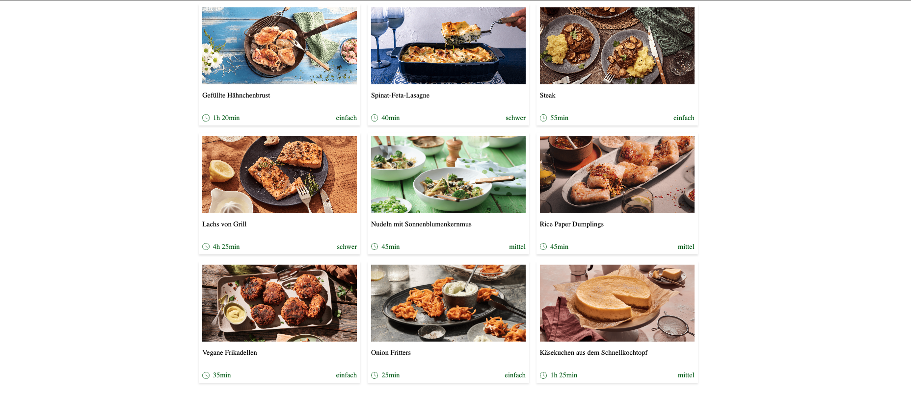

# Coding Challenge Recipe Tiles!

The prupose of this assignment is to render recipes tiles like the photo below: 

- write the code under `./components/App/App.tsx` and write the styles under `./components/App/App.css`.
- use the clock icon `./svg/clock.svg` near the time text as shown in the mockup image.
- you can call `getRecipesMock()` that is under `./api/api.ts` to get the mocked backend response and use it to render the tiles.
- Bonus Task #1: call the GET endpoint and display the fetched response: https://mocki.io/v1/707b3a42-75ef-4e34-b670-95ff34919a20
- Bonus Task #2: write unit test under `./components/App/App.test.tsx`.

## Available Scripts

In the project directory, you can run:

### `npm install`

### `npm start`

Runs the app in the development mode.\
Open [http://localhost:3000](http://localhost:3000) to view it in the browser.

### `npm test`

Run Unit Tests
